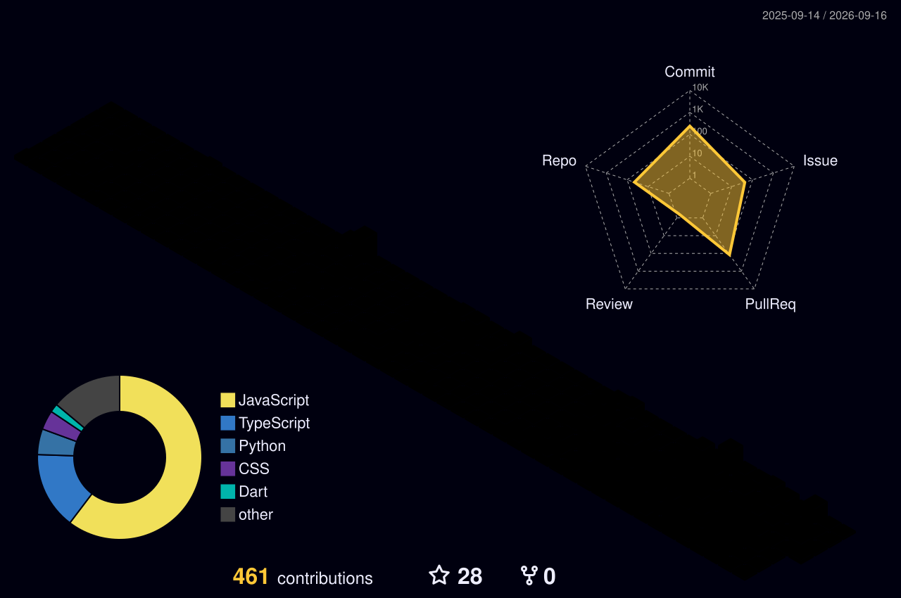

<div align="center">

[](https://git.io/typing-svg)

<br/>


[](https://github.com/anshika-guleria)

</div>

---

## 🌸 About Me

<div align="center">

</div>

<br/>

```ts
const anshika = {
  role      : "Full Stack Developer",
  focus     : ["Clean Arch", "Scalable Systems"],
  philosophy: "Maintainable > quick hacks",
  vibe      : "Design meets logic ✨",
  status    : "Always levelling up 🚀"
};
```

🏗️ Building full-stack systems that balance **elegance + scale**  
🎨 Strong opinions on **thoughtful UI + clean backend design**  
🔍 Clean code, intentional structure, meaningful products  
📚 Lifelong learner — depth over shortcuts

---

## 💗 Tech Stack

<div align="center">

| Category | Technologies |
| :--- | :--- |
| 🎨 **Frontend** |    <br><br>     |badge&logo=javascript&logoColor=black) <br><br>   |
| ⚙️ **Backend** |     |
| 🗄️ **Database & Cloud** |   |
| 📱 **Mobile** |   |
| 🛠️ **Tools** |      |
| ☁️ **Deployment** |     |

</div>

---

## 🌟 GitHub Stats

<div align="center">


</div>

---

## 💚 Contribution Overview


---
## 💗 ECSOC — Open Source Journey

<div align="center">

### 🪐 Elite Coders Social Summer of Code

<p>
  <b>🏆 Global Rank #38</b> &nbsp;•&nbsp;
  <b>⭐ 3,585 Points</b> &nbsp;•&nbsp;
  <b>🔀 105 Merged PRs</b>
</p>

<table>
  <tr>
    <td align="center">
      
    </td>
    <td align="center">
      
    </td>
    <td align="center">
      
    </td>
    <td align="center">
      
    </td>
  </tr>
</table>

### 🏅 ECSOC Badges

<table>
  <tr>
    <td align="center">
      
    </td>
    <td align="center">
      
    </td>
    <td align="center">
      
    </td>
    <td align="center">
      
    </td>
  </tr>
</table>

<br/>

</div>

---


<h2 align="center">🏆 GitHub Trophies</h2>
<p align="center">
  
</p>

---

<div align="center">

### ✦ Backend Architecture · System Design · Performance Optimization ✦

<br/>

*"Clean code always looks like it was written by someone who cares."*

<br/>


[](https://www.linkedin.com/in/anshika-guleria-039b01268/)
[](mailto:anshika.guleria.dev@gmail.com)

</div>

<br/>


